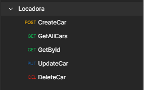

# Sobre

Tecnologias utilizadas

**FRONTEND**

- React
- Tailwindcss

**BACKEND**

- Typescript
- Prisma
- Express
- Docker

Tempo gasto: 5h

# Como utilizar o BACKEND

- **OBS**: Docker é necessário para rodar

```bash
npm install # Instalar as dependências
```

```bash
docker-compose up -d # Para rodar o driver de POSTGRESQL
```

```bash
npm run dev # OBS: na pasta do backend
```

As rotas do backend são [POSTMAN](https://www.postman.com/bold-zodiac-125512/workspace/softmakers-br/collection/22507292-0dc88546-f5dc-44b6-9d65-5e63ffa817b5?action=share&creator=22507292)



# Como utilizar o FRONTEND

Contém a parte visual do teste proposto.

```bash
npm install # Instalar as dependências
```

```bash
cd client # Ir para o diretório client
npm run dev # Rodar o frontend
```
